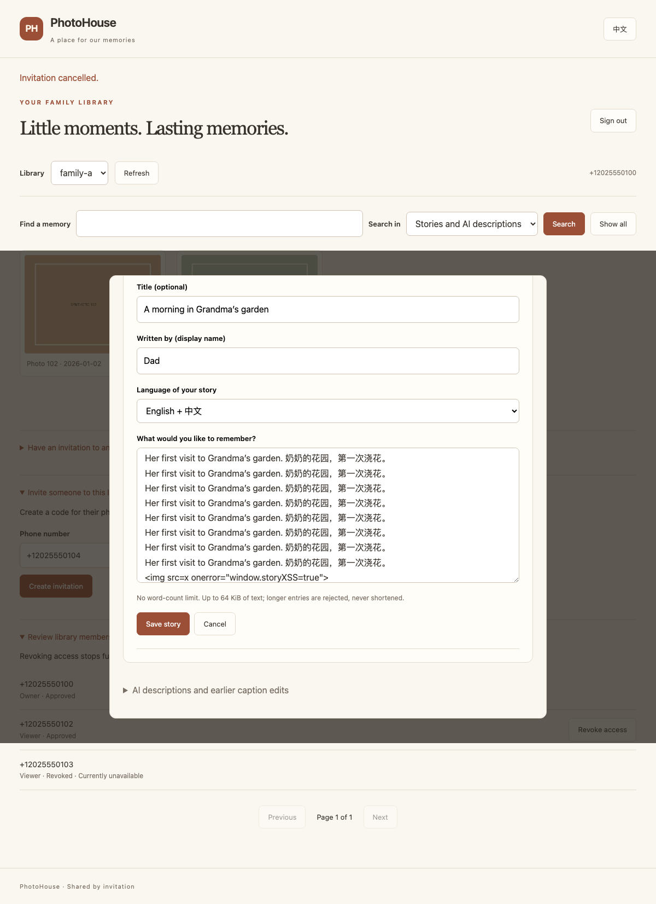
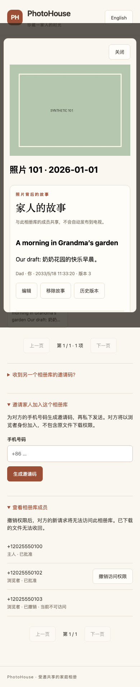

# Family Stories independent API/WebUI review

15 September 2026. Reviewed in
`/Users/yanbo/Projects/vlm-photo-engine/_worktrees/family-stories`, branch
`codex/family-stories`, based on `470f42cf6ea0cc9c1a0885d1e7f8da0eb99c2eca`.
The local `origin/master` ref matched this base at review time; no remote fetch or
live deployment-lineage check ran. Concurrent Home discovery/calendar development
is a separate branch and is not silently included in this source candidate.

## Immutable local source and package

Source commit: `97e9cc4eaa2c0ff34aa60837e84099c017927ef1`.
The follow-up evidence commit adds this receipt and the inspected synthetic images;
no production source changed after qualification.

Source ZIP: 1,806,092 bytes, 65 exact allowlisted Git files, SHA-256
`b3ac3a4b991bbb2f781d1298bf6da2224dcb82ac34c0a7636dbcf10727064600`.
Private local path:
`/Users/yanbo/.openclawy/private/photohouse-family-stories-review-20260915/source.zip`.
Every archive member matched the manifest and selected commit. A fresh-process smoke
against its extracted source passed seven ASGI checks, nine synthetic operator
commands and eight synthetic database-preparation commands at `c7f4a9e2b610`.
The archive contains source only, with no installed dependencies or private config.
No network listener or live data access was used.

The committed aggregate receipt lists the implementation's changed files. Runtime
modules, WebUI, migration, inventory, packaging, tests and operator documentation
changed; caption worker/input-preparation code and mobile worktrees did not.

## Review findings and repairs

- A successful removal whose response was lost received a fresh mutation UUID on
  retry, producing a conflict. The WebUI now retains the same deletion body/UUID
  while that viewer remains open; the regression proves one tombstone revision.
- Repeated More clicks could skip an in-flight page. The page advances only after
  a successful current response, and overlapping append requests are blocked.
- A delayed history response could overwrite a different story's selected history.
  History requests now carry a separate generation guard.
- Hiding a tab during draft revalidation could reopen the editor while hidden.
  A failing browser regression reproduced it. Draft restoration now requires a
  successful current restore, visible tab, same account/library/asset and a fresh
  writing role; aborted/stale restores cannot reopen private content.
- Valid 64 KiB text could exceed the former 128 KiB request cap after JSON escaping.
  The story-only request cap is now 512 KiB. Responses are explicitly checked after
  JSON serialization against 3 MiB, accommodating five whole stories or five
  history rows plus the current story. Maximum-size escaping, title and byline are
  tested without truncation. Existing account/caption budgets are unchanged.
- An exact old save retry can return a newer current revision. The UI now labels
  that case instead of implying the earlier draft replaced the current version.
- Operator/database preparation documents now name schema `c7f4a9e2b610`; a new
  downgrade test proves refusal leaves the schema and migration revision intact.

Authorization review retained the single current transaction for membership, parent
asset/library scope, story authorship, expected revision, receipt, history and audit.
Viewer writes/history, foreign libraries, revoked membership, removed/unmapped
parents and conflicting mutations remain denied. Search scopes both family and
caption branches before matching/counting; current and historical family text never
enters AI caption persistence. No new authorization bypass was found in these cases;
this is bounded source/synthetic evidence, not a production security certification.

## Verification

- Full security suite: **557 run, 553 passed, four native-Windows skips**, zero
  failures, 136.986 seconds. Expected negative-CLI output and pre-existing
  resource/deprecation warnings are present in the test log.
- Focused story/library suite: **38 passed**. Migration suite: **13 passed**,
  including interrupted upgrade, legacy caption preservation and downgrade refusal.
- **22 Chromium-to-ASGI scenarios passed**. Includes lost-response retry, stale
  writes, literal EN/ZH content, permissions, interrupted background revalidation,
  pagination/history races, library switching and logout. English editor and narrow
  Chinese screenshots were inspected. The harness models Fetch Metadata, rather
  than proving real network/proxy headers or physical device behavior.
- Five manual raw-JSON escaped-surrogate requests returned generic 400 responses
  without echo. The first probe was rejected by the HTTP client's encoder before
  transport; corrected raw JSON exercised the server. Shared transport regression
  tests also cover surrogate rejection.
- Inventory is complete at **180 method/path entries** for this branch. JavaScript
  syntax, relative documentation links and `git diff --check` passed.

[Aggregate evidence](security/evidence/family-stories-review/verification.json)
retains test counts, browser scenarios, environment and raw-log hashes.

## Additive client contract for coordinator adoption

The six protected routes and field shapes are documented in
[FAMILY_STORIES.md](FAMILY_STORIES.md). Android reviewed the proposed story-specific
512 KiB request / 3 MiB response limits; frozen shared captions/account contracts
were not edited. Story/history revisions, timestamps and response page/count fields
are numbers; request revision/page fields are strings. A current story's `deleted`
is boolean; history row `deleted` is 0/1. All story pages retain whole entries.

Offset pagination is a current view without snapshot semantics. Clients should
restart at page one after mutations and deduplicate IDs/revisions across pages;
concurrent changes can move boundaries. Uncertain mutation retries retain their
exact request and UUID, recheck authorization and display returned current content.
The coordinator owns committing/adopting any mobile contract pack. Android's next
slice is synthetic presentation/state only. This task changed no mobile files.

## Release gates

1. Coordinator reviews the immutable source/package and integrates with other
   branches, rerunning route inventory and affected tests after any merge. No push
   or merge is authorized by this return.
2. Separately approved Windows inspection must establish the actual installed
   protected-versus-legacy lineage, principal, dependencies, schema and all writers.
   Rehearse candidate migration/backup recovery and benchmark scoped search with
   the intended library before rollout. Preserve captions and GPU preparation.
3. Upgrade only an explicitly approved protected runtime with bounded ingress/body
   handling and real TLS/ACL checks. Older code rejects this newer schema; do not
   downgrade a live database containing stories. Retaining schema/data and disabling
   the feature is distinct from restoring a backup with post-backup writes.
4. Adopt the additive native contract, then implement/test phone networking and
   real-device lifecycle states. iOS, installed APK and physical acceptance remain
   separate. Synthetic browser tests do not establish those results.
5. Anonymous TV needs an independently reviewed approved-story export with audience,
   publication revision and withdrawal semantics. No private stories may enter the
   existing TV feed automatically. Contributor provisioning, retention/permanent
   erasure, and legacy-caption conversion remain separate policy/product work.

No Windows connection, real database/media read, caption/GPU action, network listener,
service restart, deployment, APK change, push or merge was performed. Other worktrees,
including the caption-input preparation edits, were preserved.
