# VLM Photo Engine - Architecture Diagrams

**Visual Architecture Documentation with Mermaid Charts**  
**Date**: 2025-08-16  
**Status**: Production Implementation

---

## 1. System Overview Architecture


## 2. End-to-End Data Flow

```mermaid
flowchart TD
    START([User Uploads Photos]) --> DISCOVER[📁 Photo Discovery<br/>File System Scanning]
    
    DISCOVER --> EXTRACT[🔍 Metadata Extraction<br/>EXIF, Hash, File Info]
    EXTRACT --> DEDUP{🔄 Deduplication Check<br/>SHA256 + Perceptual Hash}
    
    DEDUP -->|New Photo| TASK_QUEUE[📋 Task Queue<br/>Schedule Processing]
    DEDUP -->|Duplicate| SKIP[⏭️ Skip Processing<br/>Link to Existing]
    
    TASK_QUEUE --> PARALLEL{🔀 Parallel Processing}
    
    %% Parallel processing branches
    PARALLEL --> THUMB[🖼️ Thumbnail Generation<br/>Multiple Sizes]
    PARALLEL --> EMBED[🧠 Image Embeddings<br/>CLIP Model]
    PARALLEL --> CAPTION[💬 Caption Generation<br/>BLIP2 Model]
    PARALLEL --> FACES[👤 Face Detection<br/>MTCNN/LVFace]
    
    %% Processing results
    THUMB --> STORAGE1[💾 Store Thumbnails<br/>File System]
    EMBED --> VECTOR_INDEX[📊 Update Vector Index<br/>FAISS]
    CAPTION --> DB_CAPTION[💾 Store Captions<br/>SQLite Database]
    
    %% Face processing flow
    FACES --> FACE_EMBED[🧠 Face Embeddings<br/>LVFace Model]
    FACE_EMBED --> CLUSTER[🎯 Face Clustering<br/>Vector Similarity]
    CLUSTER --> PERSON_DB[👥 Person Management<br/>Database Storage]
    
    %% Final steps
    STORAGE1 --> COMPLETE[✅ Processing Complete]
    VECTOR_INDEX --> COMPLETE
    DB_CAPTION --> COMPLETE
    PERSON_DB --> COMPLETE
    SKIP --> COMPLETE
    
    %% Search availability
    COMPLETE --> SEARCHABLE[🔍 Photo Now Searchable<br/>Via Multiple Methods]
    
    %% Styling
    classDef start fill:#e8f5e8,stroke:#2e7d32,stroke-width:3px
    classDef process fill:#e3f2fd,stroke:#1976d2,stroke-width:2px
    classDef model fill:#f3e5f5,stroke:#7b1fa2,stroke-width:2px
    classDef storage fill:#fff8e1,stroke:#f57c00,stroke-width:2px
    classDef complete fill:#e8f5e8,stroke:#388e3c,stroke-width:3px
    
    class START,SEARCHABLE start
    class DISCOVER,EXTRACT,DEDUP,TASK_QUEUE,PARALLEL,THUMB,CLUSTER process
    class EMBED,CAPTION,FACES,FACE_EMBED model
    class STORAGE1,VECTOR_INDEX,DB_CAPTION,PERSON_DB storage
    class COMPLETE complete
```



## 3. Search Architecture Flow

```mermaid
flowchart TD
    USER_QUERY[👤 User Search Query] --> PARSE_TYPE{🔍 Parse Query Type}
    
    %% Query type routing
    PARSE_TYPE -->|Text Query| TEXT_SEARCH[📝 Text-Based Search]
    PARSE_TYPE -->|Image Query| IMAGE_SEARCH[🖼️ Image-Based Search]
    PARSE_TYPE -->|Person Query| PERSON_SEARCH[👤 Person-Based Search]
    PARSE_TYPE -->|Hybrid Query| HYBRID_SEARCH[🔀 Hybrid Search]
    
    %% Text search flow
    TEXT_SEARCH --> TEXT_EMBED[🧠 Generate Text Embedding<br/>CLIP Text Encoder]
    TEXT_EMBED --> VECTOR_SEARCH1[📊 Vector Similarity Search<br/>FAISS Index]
    
    %% Image search flow  
    IMAGE_SEARCH --> IMAGE_EMBED[🧠 Generate Image Embedding<br/>CLIP Image Encoder]
    IMAGE_EMBED --> VECTOR_SEARCH2[📊 Vector Similarity Search<br/>FAISS Index]
    
    %% Person search flow
    PERSON_SEARCH --> PERSON_LOOKUP[👥 Person Database Lookup<br/>By Name or ID]
    PERSON_LOOKUP --> FACE_QUERY[👤 Face Embedding Query<br/>Person Vector Search]
    FACE_QUERY --> ASSET_LOOKUP[🔗 Asset Association<br/>Face → Photo Mapping]
    
    %% Hybrid search flow
    HYBRID_SEARCH --> MULTI_EMBED[🧠 Multiple Embeddings<br/>Text + Image + Person]
    MULTI_EMBED --> WEIGHTED_SEARCH[⚖️ Weighted Vector Search<br/>Combined Similarity]
    
    %% Results processing
    VECTOR_SEARCH1 --> FILTER[🔧 Apply Filters<br/>Date, Location, Tags]
    VECTOR_SEARCH2 --> FILTER
    ASSET_LOOKUP --> FILTER
    WEIGHTED_SEARCH --> FILTER
    
    FILTER --> RANK[📈 Rank & Score Results<br/>Relevance + Metadata]
    RANK --> PAGINATE[📄 Paginate Results<br/>Page Size Control]
    PAGINATE --> RETURN[📤 Return Search Results<br/>JSON Response]
    
    %% Styling
    classDef user fill:#e8f5e8,stroke:#2e7d32,stroke-width:3px
    classDef process fill:#e3f2fd,stroke:#1976d2,stroke-width:2px
    classDef model fill:#f3e5f5,stroke:#7b1fa2,stroke-width:2px
    classDef database fill:#fff8e1,stroke:#f57c00,stroke-width:2px
    classDef result fill:#e8f5e8,stroke:#388e3c,stroke-width:3px
    
    class USER_QUERY,RETURN user
    class PARSE_TYPE,TEXT_SEARCH,IMAGE_SEARCH,PERSON_SEARCH,HYBRID_SEARCH,FILTER,RANK,PAGINATE process
    class TEXT_EMBED,IMAGE_EMBED,MULTI_EMBED,VECTOR_SEARCH1,VECTOR_SEARCH2,WEIGHTED_SEARCH model
    class PERSON_LOOKUP,FACE_QUERY,ASSET_LOOKUP database
    class RETURN result
```



## 4. Provider Architecture Diagram


## 5. Task Processing Flow


## 6. Health Monitoring Architecture

```mermaid
graph LR
    subgraph "Health Check System"
        HEALTH_API[Health API Endpoints]
        MONITORS[Component Monitors]
        VALIDATORS[Configuration Validators]
        ALERTS[Alert System]
    end
    
    subgraph "Monitored Components"
        DB_HEALTH[Database Health<br/>Connection & Performance]
        VECTOR_HEALTH[Vector Index Health<br/>Size & Query Performance]
        MODEL_HEALTH[Model Health<br/>Availability & Performance]
        TASK_HEALTH[Task Queue Health<br/>Backlog & Processing Rate]
        STORAGE_HEALTH[Storage Health<br/>Disk Space & I/O]
    end
    
    subgraph "Health Endpoints"
        GENERAL[/health<br/>General System Status]
        CAPTION_HEALTH[/health/caption<br/>Caption Provider Status]
        FACE_HEALTH[/health/lvface<br/>Face Provider Status]
        METRICS[/metrics<br/>Prometheus Metrics]
    end
    
    %% Monitoring connections
    MONITORS --> DB_HEALTH
    MONITORS --> VECTOR_HEALTH
    MONITORS --> MODEL_HEALTH
    MONITORS --> TASK_HEALTH
    MONITORS --> STORAGE_HEALTH
    
    %% Validation connections
    VALIDATORS --> MODEL_HEALTH
    VALIDATORS --> CAPTION_HEALTH
    VALIDATORS --> FACE_HEALTH
    
    %% API connections
    HEALTH_API --> GENERAL
    HEALTH_API --> CAPTION_HEALTH
    HEALTH_API --> FACE_HEALTH
    HEALTH_API --> METRICS
    
    %% Alert connections
    MONITORS --> ALERTS
    VALIDATORS --> ALERTS
    
    classDef endpoint fill:#e8f5e8,stroke:#2e7d32,stroke-width:2px
    classDef component fill:#e3f2fd,stroke:#1976d2,stroke-width:2px
    classDef system fill:#fff3e0,stroke:#f57c00,stroke-width:2px
    
    class GENERAL,CAPTION_HEALTH,FACE_HEALTH,METRICS endpoint
    class DB_HEALTH,VECTOR_HEALTH,MODEL_HEALTH,TASK_HEALTH,STORAGE_HEALTH component
    class HEALTH_API,MONITORS,VALIDATORS,ALERTS system
```

## 7. Model Communication Protocol


## 8. Deployment Architecture


---

## 9. Implementation Status Dashboard

```mermaid
gitgraph
    commit id: "Phase 0: Foundation"
    commit id: "FastAPI + Health Endpoints"
    branch ingestion
    checkout ingestion
    commit id: "Phase 1: Core Ingestion"
    commit id: "EXIF + Hashing + Dedup"
    checkout main
    merge ingestion
    branch embeddings
    checkout embeddings
    commit id: "Phase 2: Embeddings"
    commit id: "CLIP + FAISS Vector Search"
    checkout main
    merge embeddings
    branch captions
    checkout captions
    commit id: "Phase 3: Caption System"
    commit id: "BLIP2 Integration ✅"
    commit id: "External Model Architecture ✅"
    commit id: "JSON IPC Protocol ✅"
    checkout main
    merge captions
    branch faces
    checkout faces
    commit id: "Phase 4: Face Recognition"
    commit id: "LVFace Integration ✅"
    commit id: "Person Management ✅"
    commit id: "Multi-Provider System ✅"
    checkout main
    merge faces
    commit id: "🎉 Production Ready"
    commit id: "Documentation Update v2.0"
```

---

## 10. Performance Metrics Flow


---

**Status**: ✅ **Comprehensive Visual Architecture Documentation**  
**Features**: System overview, data flows, provider architecture, health monitoring  
**Implementation**: Production-ready with 20.96 GB local models and dual environment  
**Next**: Web UI integration and end-to-end user testing
